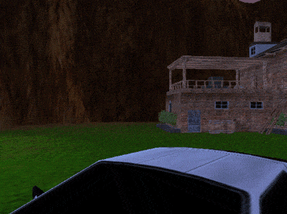

A software renderer created for educational purposes.

## Features
* 2 rasterizers (scanline, half-space/barycentric-interpolation)
* Mipmapping
* Texture filtering (point, bilinear, trilinear)
* Customizable shaders
* Per-pixel lighting (ambient, directional, point, spot)
* SIMD optimizations
* Multithread rendering
* No external dependancies except FBX SDK
* 3DS Max scene layout export/import (MAXScript/JSON)
* FBX Model loader
* 24/32 bit Bitmap/Targa loaders

## Performance
* ~15,000 triangles
* 4 pixel lights (1 directional, 1 point, 2 spot)
* Mipmapping and bilinear filtering enabled
* Multithread rendering enabled
* 640x480 resolution
* i7 3820QM (2.7-3.7 GHz)
* 60 FPS Average

## Build
* VS2015+
* CPU with SSE2+

## Controls
Key | Action
--- | ------
W | forward
A | left
S | back
D | right
Q | up
E | down
Left-click | mouse look
P | use point texture filtering
B | use bilinear texture filtering
T | use trilinear texture filtering
M | toggle mipmaps
L | toggle lighting
C | toggle framerate cap
R | reload scene_settings.json
